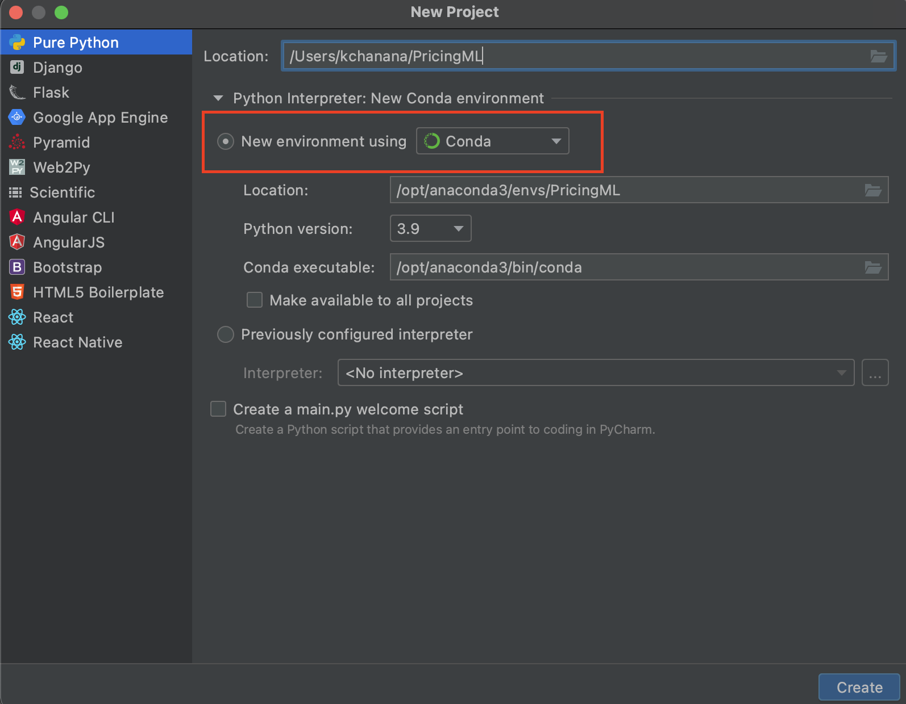

## Setup

Download and Install Anaconda from https://www.anaconda.com/products/individual

After installing add the following to ~/.bash_profile in terminal 

```buildoutcfg
export PATH=$PATH:/Users/<NT_USERNAME>/opt/anaconda3/bin/conda

The PATH is the installation location on MAC OSX
```

Download and Install PyCharm from https://www.jetbrains.com/pycharm/download/#section=mac

## Environment Creation

Step 1 : In PyCharm, create a new project using Conda environment as below-

<p align="center">
  
</p>

Step 2: Clone this repository in the project terminal
```buildoutcfg
git clone git@github.corp.ebay.com:Monetization/pricingml.git
```

Step 3: Move into pricingml directory
```buildoutcfg
cd pricingml
```

Step 4: To install all required packages and dependencies, create the Conda environment using
```buildoutcfg
conda env create --name pricexml --file environment.yml
```

Step 5: Activate environment using
```buildoutcfg
conda activate pricexml
```

To deactivate environment
```buildoutcfg
conda deactivate
```


## Authentication
 
 In the pricingml/utils directory, find the file credentials.
 
 Enter username in the first line (ex: kashishchanana)<br>
 Enter pin followed by yubikey hash in the second line (ex: 123456yubikeycode)
 
 
 ## Arguments

--connect<br>
Enter y to set up a new connection 

--feecode <br>
Enter Fee Code to be Analyzed

--siteid <br>
Enter Listing Site ID

--multi <br>
Enter y for multivariate forecasting 

--hourly <br>
Enter the number of hours you want to aggregate the data on ex: 12 for 12 hourly analysis

--WoW <br>
Enter y for Week on Week Analysis 

--substier <br>
Enter y for Analysis by SUBS_TIER 

--model_name <br>
Specify the ML model you want to run, use Prophet-Multi

## Execution

Run the main file in the project terminal as below- <br>

```buildoutcfg
python3 main.py --connect 'y' --feecode 6001 --siteid 0 --multi 'y' --WoW y --hourly 12 --model_name Prophet-Multi --substier y

```
 


